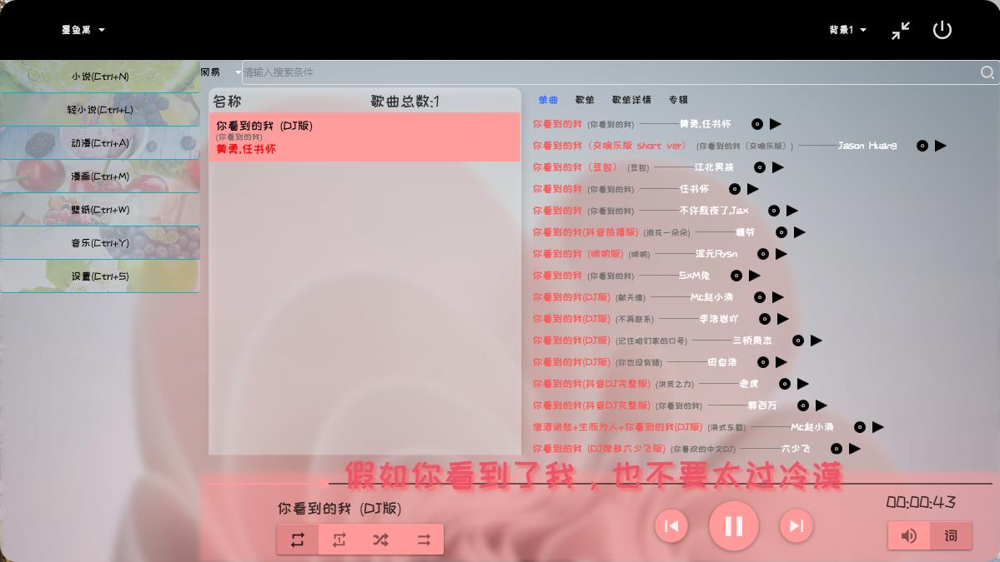
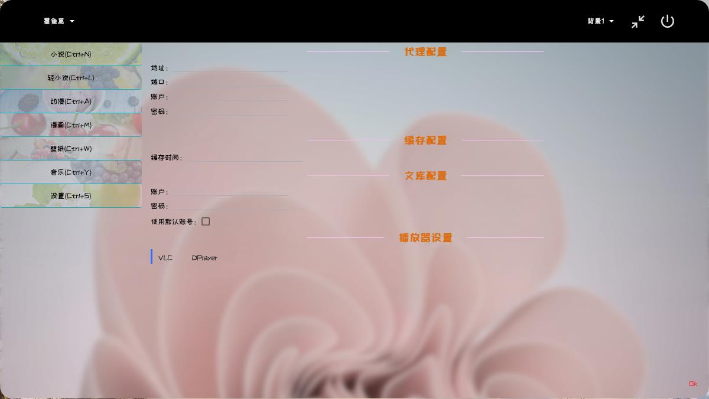
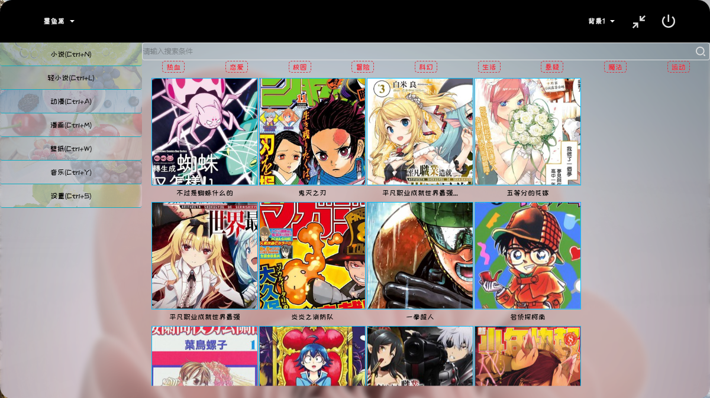
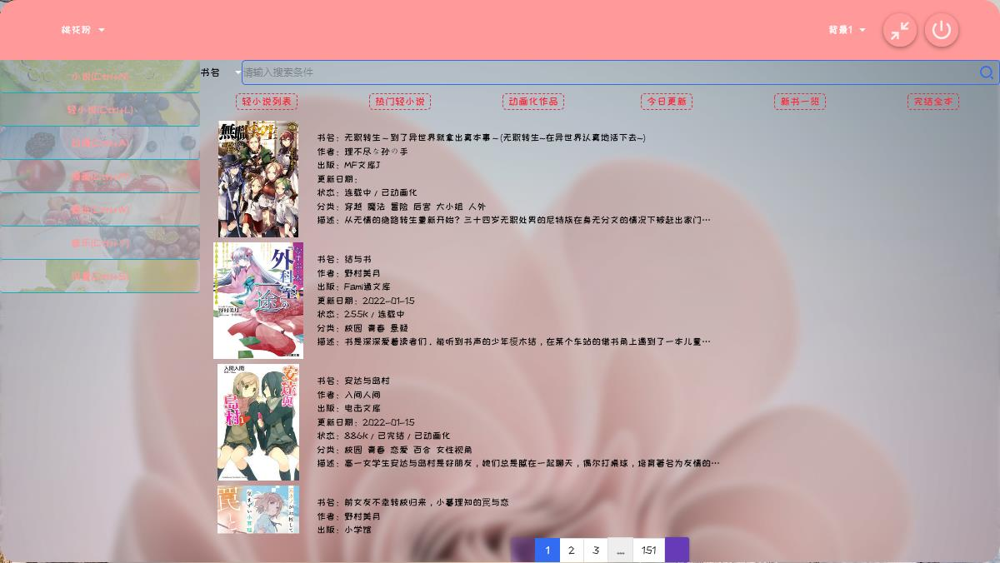
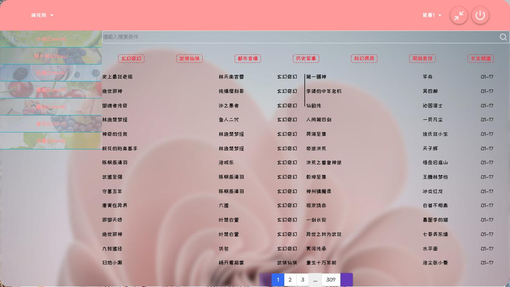

# 项目名称：轻风神器

### 项目简介：

一款基于C#.NET 6开发的WPF桌面软件，支持在线看小说，轻小说，上K站（需要梯子），看动漫，全网听歌等等，界面采用[MaterialDesignThemes](https://github.com/MaterialDesignInXAML/MaterialDesignInXamlToolkit) 和[HandyControl](https://github.com/ghost1372/HandyControls)进行页面绘制，内部播放采用的是windows版本VLCX64和DPlayer，不支持低分辨率屏幕，有好的建议和BUG请提交在[此处](https://github.com/EmilyEdna/Lote/issues)

### 功能介绍：

1.支持小说的搜索，阅读。

2.轻小说内部集成开发者的账号和密码，使用者请自行在配置页面配置账号和密码，支持无版权小说下载阅读，可以看插图，支持作者和书籍名称搜索。

3.支持K站访问(需要电脑使用梯子)，支持搜索、收藏、下载、预览大图。

4.支持全网动漫观看，包括深夜档，采用VLC播放。

5.支持QQ、网易、咪咕、酷狗、酷我、B站的音乐播放，支持歌单、专辑、歌词等。

6.支持汉化漫画的在线观看和下载。

7.程序提供丰富的个性化功能，支持背景替换，主题颜色等。

8.功能持续开发中~~~

### 注意事项：

1.看漫画时因为图片过大可能会导致内存溢出，具体请看任务管理器软件的内存使用情况，目前测试过程中看漫画内存占用在700-800M不等，GC回收内存也会等待一会儿，GC回收完成后软件内存占用大约在20M-80M之间。

2.此软件仅供学习使用，不准不能用于商业。

### 打赏作者：

### 软件截图：

